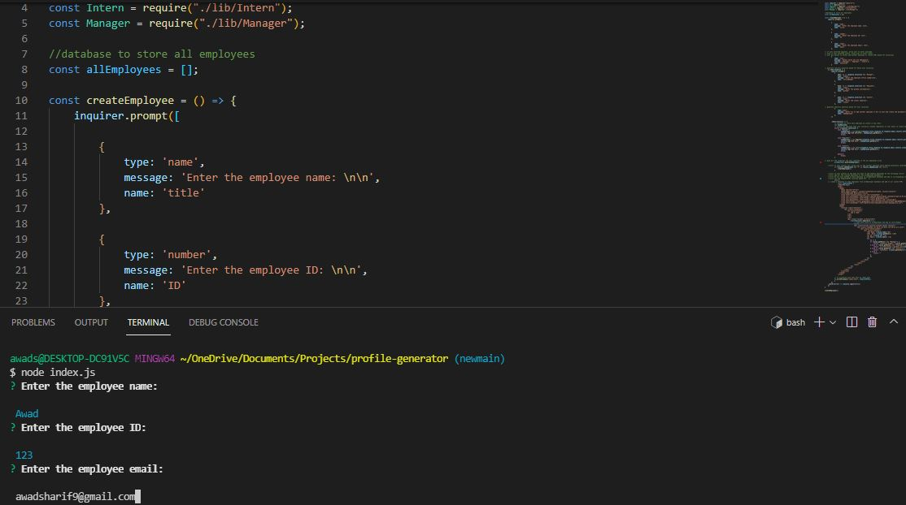
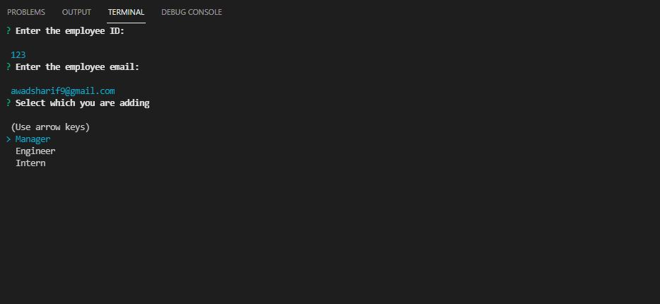
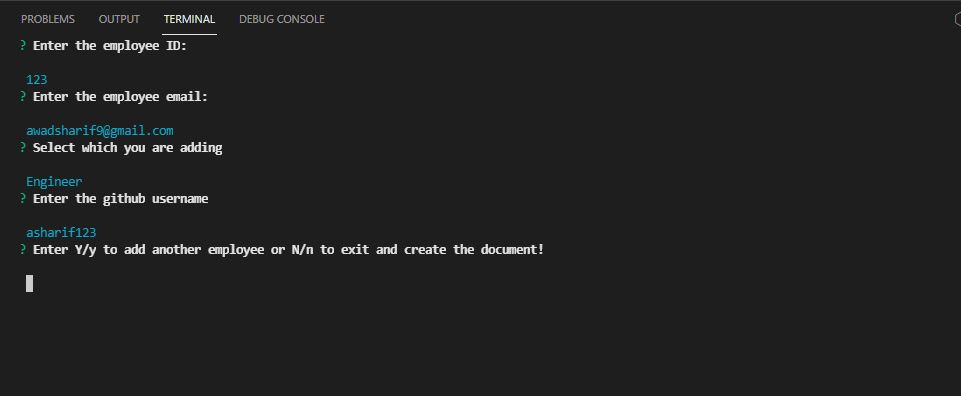

# profile-generator

Profile Generator is a program that allows one to create an employee database for either Manager, Engineer, or Intern.

An HTML document is then created containing employee information with the corresponding email, employee ID, and either the Office number, github username or school name depending on if the user has selected Manager Engineer, or Intern.

This was created using HTML, CSS, Bootstrap and Javascript.

Javascript was used to pull the Jest and Inquirer libraries in order to both execute test to ensure user has properly created the Employee, Intern, Engineer and Manager classes and also using Inquirer to take user input where the employee database is created.

Here are the screenshots:

The user will be prompted to enter the employee name, ID and email when node index.js is executed

After entering the email, the user will then select the employee type (Engineer, Manager, or Intern) and specific questions will be generated depending on selection type.

For example, if user selected "Engineer", the next question prompt will ask user for their github username or if user selected "Manager", user will be prompted to enter office number.

Once the user has entered the employee information, the user will be asked to either create another employee or create the employee database.

If the user selects yes, the profile-generator program will restart and allow the user to add more employees.

If the user selected no, an HTML document is auto-generated containing the create employees with corresponding information per screenshot below:

